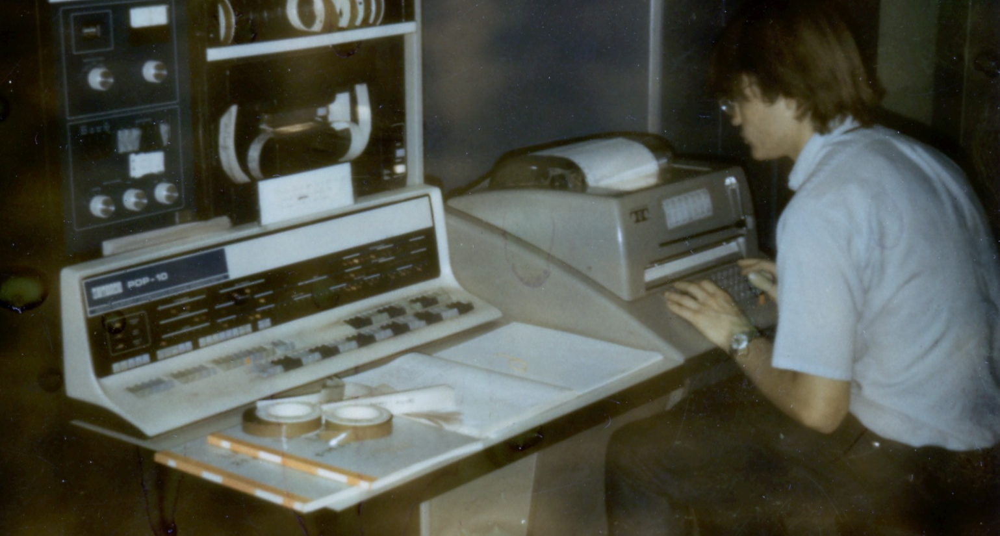
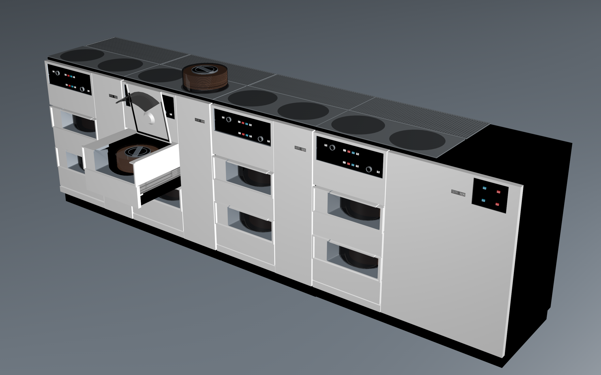
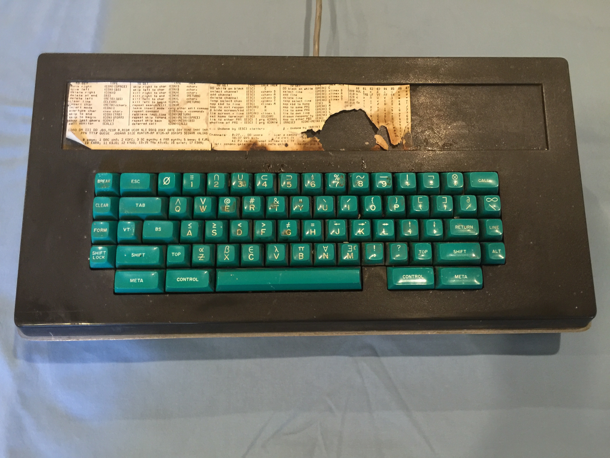
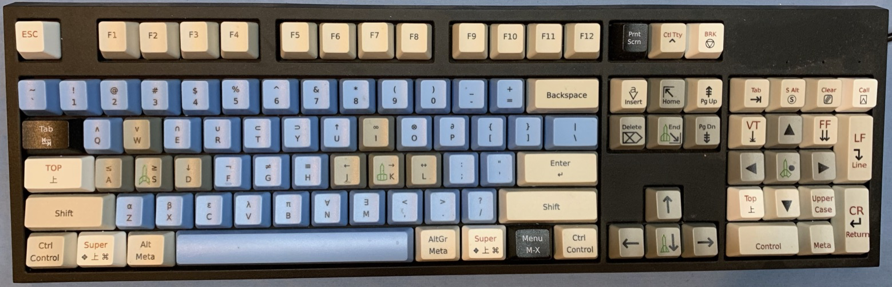

# KA10sn32

Simulators for the unique PDP-10 KA serial number 32 at Stanford for July 1974.
Two extra opcodes, XCTR and FIXX, were hacked into this machine by Dave Poole;
and July 1974 is just after the IBM-3330 "pizza oven" multi-pack disk system
had been upgraded to double-density with 200 Megabytes per spindle;
but before the BBN address mapping box was installed in 1975.
There were perhaps 275 PDP-10-KA serial numbers.

The simulated hardware configuration is as follows:

generic | specific
-------------------------- | --------------------------------
disks for file system | IBM-3330 with 200MB per drive
disk for swapping | Librascope
vector graphics terminals | Information International Inc
raster graphics terminals | Data Disc
console teletype | Teletype Model 35
teletype terminals | Teletype Model 37
teletype terminals | Teletype Model 33
custom keyboard scanner | designed by Lester Earnest
custom keyboards | from Micro Switch Corp Freeport, Illinois
custom video switch | designed by Lester Earnest
custom color video | made by Lynn Quam
The wizard in the picture | is Dave Poole
chain line printer | Data Products
xerographic printer | Xerox Graphics Printer
custom calendar clock | made by Phil Petit
mobile robot | Stanford Cart
robot arms | by Vic Scheinman

Earlier 1960s Stanford hardware is not included in these simulators:
the Rancho Arm, the III image dissector and the Type-30 display which was returned to Suppes's PDP-1 on campus.
Significant 1974 hardware which NOT included in these simulators
are all the co-processors: the PDP-6, the IMP interface, the PDP-11/45,
the Mars Image processor known as the SPS-41 and the Imlac terminals.
The unrealible Librascope is resurrected into perfect existence ready for swapping,
but then is not needed or used by these simulators after its existence is noticed.
With the exception that the Librascope sector register is used as a source of random numbers.

# disk pack set

Supporting the simulators there is a common pool of file-systems and data-sets.

# custom keyboard

Above is one of the original 1970s keyboards for SAIL-WAITS in the D.C.Power Building.
Below is a recent 2010s WASD custom keyboard for SAILDART simulators.

The key board with green key caps is authentic. Earnest is quite certain
that the zero 0-key should be to the left of the one 1-key.
The key board with blue key caps is practical for 21st century people.
Note the five space ship icons which serve as spacewar buttons.
The arrangement of the 26 Stanford
unique characters differs between
the green and blue keyboards.

count | class | glyphs
----- | ---------- | -------------
6 | Math       |  ≤ ≥ ≠ ≡ ∂ ∞
6 | Logic      |  ∀ ∃ ∧ ∨ ⊗ ¬
4 | Horseshoes |  ∩ ∪ ⊂ ⊃
5 | Arrows     |  ↑ ← → ↔ ↓
5 | Greek      |  α β ε λ π

# definitions

*Simulators* are software packages that implement a classic computer at what Gordan Bell calls the ISP level.
Professor Gordan Bell and Professor Allen Newell
wrote the text-book *Computer Structures: Readings and Examples*
DEC employee Gordan Bell (with Alan Kotok and others) designed and built the PDP-6 and the PDP-10.

*Emulators* implement a computer at the gate/wire logic level, which now resembles
PLA (Programmable Logic Array) prom programming or for that matter a μprocessor level implementation of the ISP.

Unlike the contemporous IBM/360 series of machine implementations,
which attempted compliance with an overall Principles-of-Operation;
the Digital Corporation PDP-10 family is a sequence of clades
based on manually drafted engineering drawings,
which were customized per installation,
A maintenance manual that explains the drawing notation and the major logic circuits;
and most useful, the PDP-10 software titled *Maintenance-DEC-10*
which is a set of programs named *MAINDEC-10-DAK* with the copies here of a relevant sample:
AA, AB, AC, AD, AE, AF, AG, AH, AI, AJ, AK, AL, AM then BA and finally DA in 1977.

# Simulators

## Supnick SIMH

## Cornwell SIM

## Baumgart

### Simka is a knock-down from Cornwell
### Do-Run-Run is a messy 'C' with some Supnick code
### KA10_SYSTEM_J17 unfinished 'D'
### j5, j6 and j7 are embedded inside https://saildart.org as 'Java Script' code with too many windows.
### pyg is a Pythonic GEOMED at user level
### toyten is a user level WAITS API library in 'C'

# A Bag Bitting Tongue Twister

In the late 1960s, before the Jargon files went virial (read unhappy MAKNAM),
when we were young, we could pronouce all of the PDP-1 and PDP-10 opcodes;
as well as all the crytic labels from the SYSTEM or from LISP.

   Pdl, datum, dpy, dap,
   tty, pty, fadr,
   jfcl, jffo, pdlov, lap,
   car, cdr, cadr !

   Piddle, datum, dippy, dap,
   titty, pity, fadder,
   jif-cull, jif-foe, piddle-of, lap,
   car, coupe-der, cad-der

Dave Poole, of the Foonly crowd, would often pronouce half-word opcodes even in
what started out as a normal conversation with outsiders.

