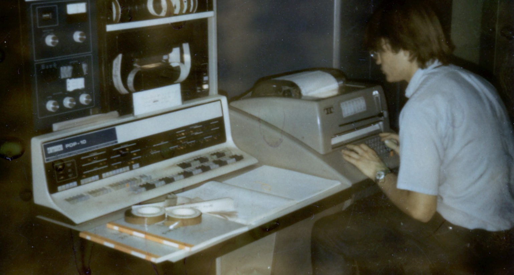
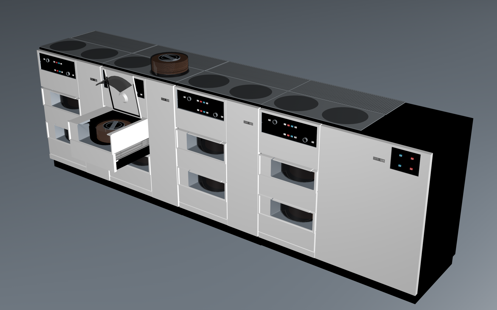
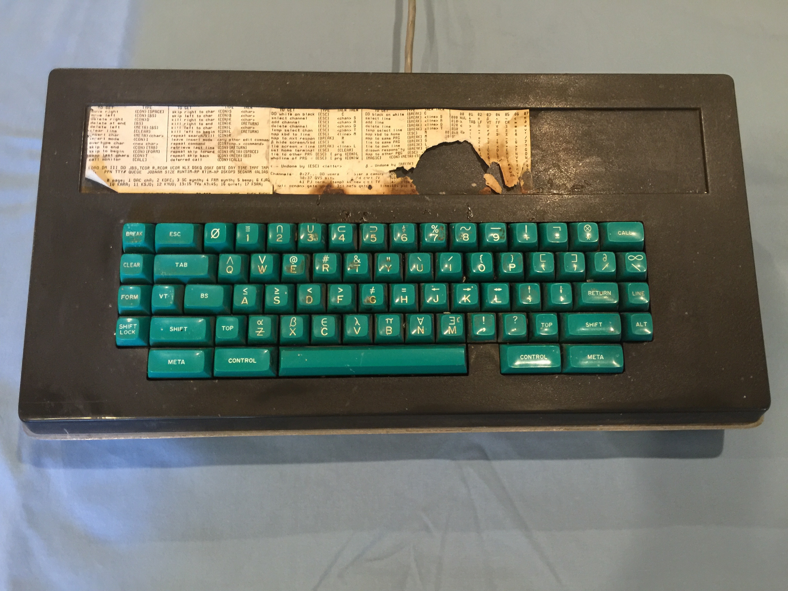
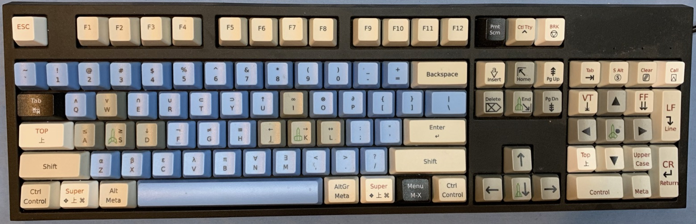

# KA10sn32

Simulators for the unique PDP-10 KA serial number 32 at Stanford in July 1974.
The simulated hardware configuration is as follows:

generic | specific
-------------------------- | --------------------------------
disks for file system | IBM-3330 with 200MB per drive
disk for swapping | Librascope
vector graphics terminals | Information International Inc
raster graphics terminals | Data Disc
console teletype | Teletype Model 35
teletype terminals | Teletype Model 37
teletype terminals | Teletype Model 33
custom keyboard scanner | designed by Lester Earnest
custom keyboards | from Micro Switch Corp Freeport, Illinois
custom video switch | designed by Lester Earnest
custom color video | made by Lynn Quam
The wizard in the picture | is Dave Poole
chain line printer | Data Products
xerographic printer | Xerox Graphics Printer
custom calendar clock | made by Phil Petit
mobile robot | Stanford Cart
robot arms | by Vic Scheinman

# disk pack set

Supporting the simulators there is a common pool of file-systems and data-sets.

# custom keyboard

Above is one of the original 1970s keyboards for SAIL-WAITS.
Below is a recent 2010s WASD custom keyboard for SAILDART simulators.

